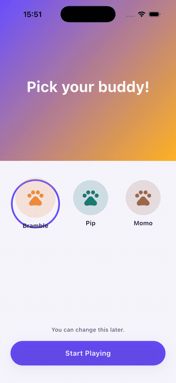
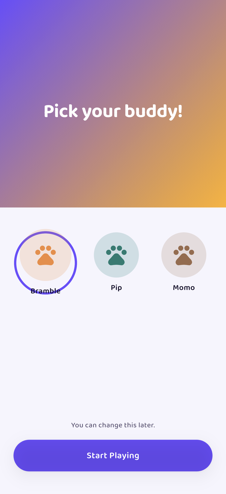
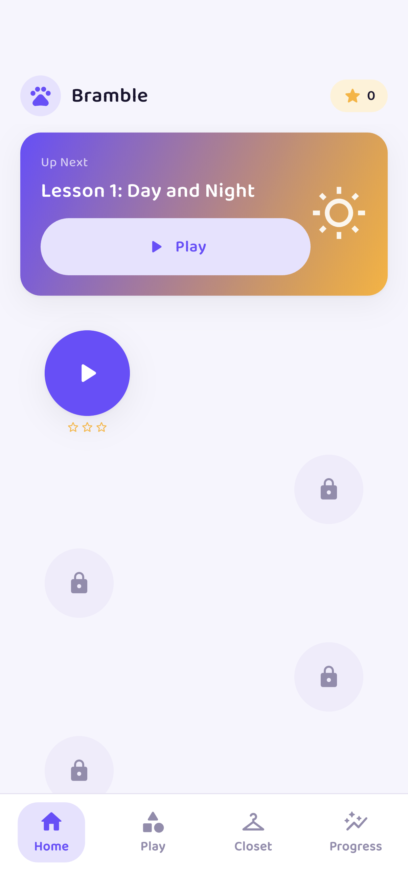
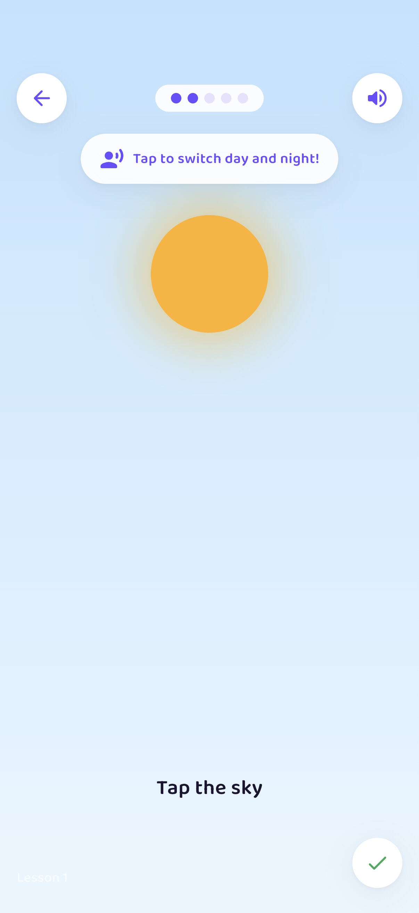
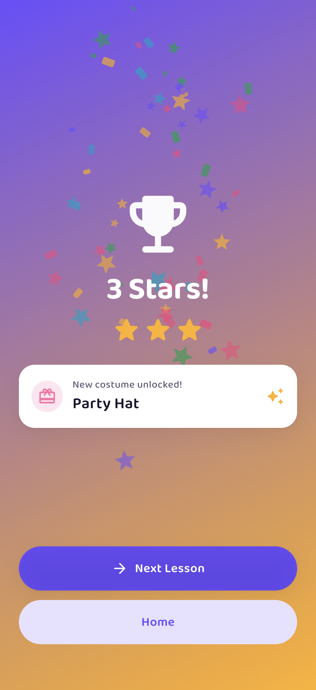
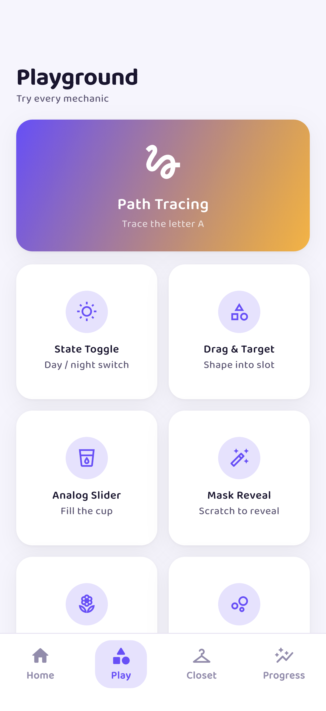
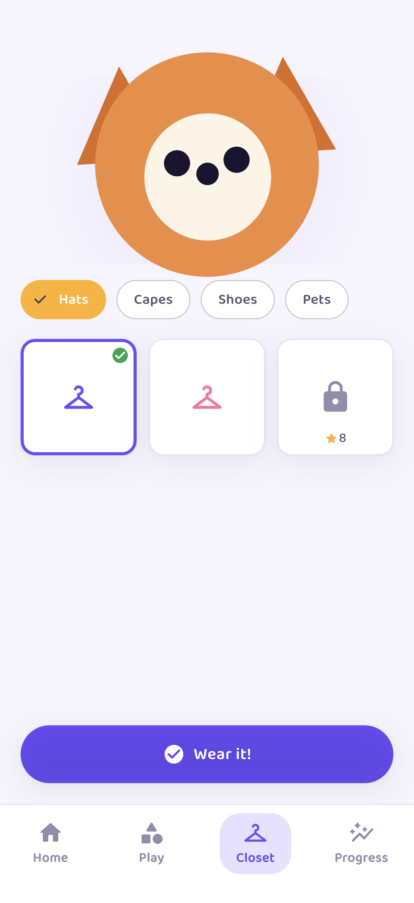
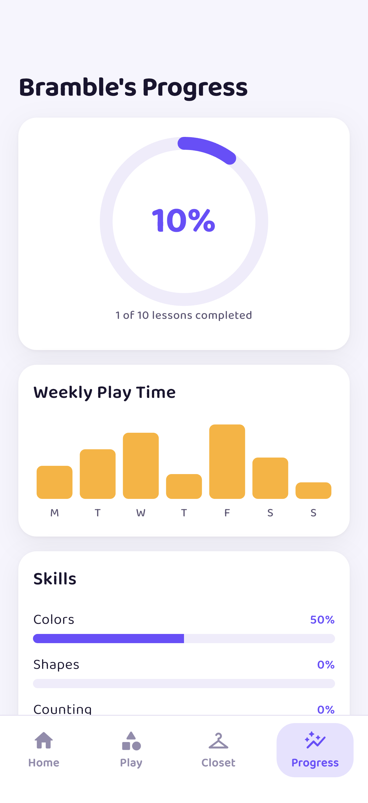
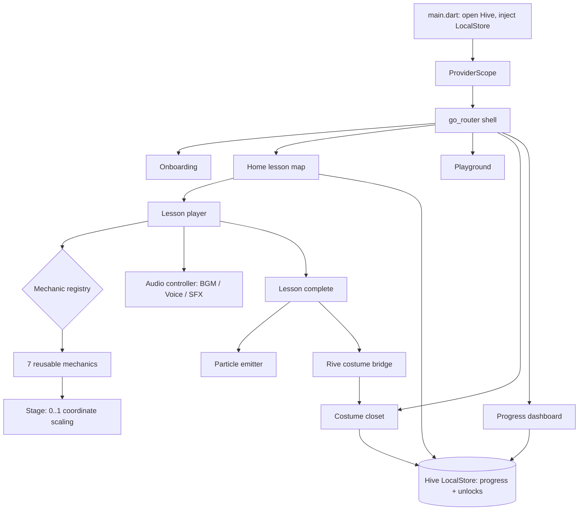

# Bloom Play - Responsive 2D Interactive Learning Engine (Flutter)

A production-shaped **Flutter engine** for premium 2D interactive preschool
lessons that scale flawlessly from a **4:3 tablet to a 19.5:9 phone**. It ships
the full "architecture shell" - dynamic coordinate scaling, seven reusable
interaction mechanics, a Rive costume bridge, a 3-channel audio controller, a
non-physics particle emitter, and offline Hive persistence - plus a 10-lesson
pilot assembled entirely from those templates.

Built with **Flutter + Riverpod + go_router + Hive + Rive**, matching a Google
Stitch design system (Baloo 2, violet `#6B4EFF` / amber `#FFB020`).

<p align="center">
  
</p>

## Screens

| Onboarding | Home lesson map | Lesson player |
|---|---|---|
|  |  |  |

| Celebration | Mechanic playground | Costume closet |
|---|---|---|
|  |  |  |

| Progress dashboard |
|---|
|  |

## What it shows

- **Dynamic coordinate scaling** - every hitbox, target and token is authored
  in a virtual `0..1` coordinate space (`core/responsive/stage.dart`). A
  mechanic authored once renders identically on any aspect ratio and never
  drifts off-screen. `Stage` resolves pixels per layout; `StageBox` positions
  children by fraction; a fractional hit-test decides collisions.
- **The 7 core mechanic templates** (`mechanics/`), each reusable and
  responsive: **State Toggle**, **Drag & Target** (collision), **Analog
  Slider**, **Mask Reveal**, **Path Tracing**, **Tap & Hold**, **Physics
  Spawn**. A `mechanic_registry` maps a `MechanicType` to its widget, so a
  junior dev authors a new lesson by adding data - not code.
- **Rive Animation Bridge** (`core/rive/costume_bridge.dart`) - the seam a
  `mascot.riv` plugs into. Exposes skin-swap and randomized global-reaction
  inputs behind a runtime-agnostic API; renders a painted mascot fallback so
  the app is demoable with no artist assets.
- **3-channel audio controller** (`core/audio/`) - a strict BGM / Voice / SFX
  mixer. BGM loops one track, Voice replaces the active line (no overlap), SFX
  is volume-governed. A pluggable `AudioSink` keeps the demo asset-free.
- **Lightweight particle emitter** (`core/particles/`) - closed-form ballistic
  confetti + stars via `CustomPaint`, no per-frame physics integration.
- **Offline persistence** (`core/persistence/`) - Hive stores best-star lesson
  progress and costume unlocks with no backend; survives restarts.
- **10-lesson pilot** built entirely from the templates, with a navigation
  shell (`go_router`), a winding lesson map, a costume closet with star-gated
  unlocks, and a parent progress dashboard.

## Architecture



State is owned by Riverpod providers (`state/providers.dart`): a
`ProgressController` records best stars, auto-unlocks affordable costumes, and
equips skins; the audio controller and costume bridge are `ChangeNotifier`s.

## Run

```sh
flutter pub get
flutter run            # any iOS/Android device or simulator
```

The app is fully demoable on a simulator - no camera, BLE, audio assets, or
network required. Every mechanic is finishable with a tap.

## Project layout

```
lib/
  core/
    responsive/stage.dart        # dynamic coordinate scaling
    audio/audio_controller.dart  # 3-channel mixer
    persistence/local_store.dart # Hive
    particles/particle_emitter.dart
    rive/costume_bridge.dart     # Rive bridge + painted fallback
  mechanics/                     # the 7 templates + registry
  data/                          # models + 10-lesson pilot content
  state/providers.dart           # Riverpod
  router/app_router.dart         # go_router shell
  screens/                       # onboarding, home, lesson, closet, ...
  widgets/                       # pill button, cards, tab bar
design/                          # Google Stitch source-of-truth screens
```
